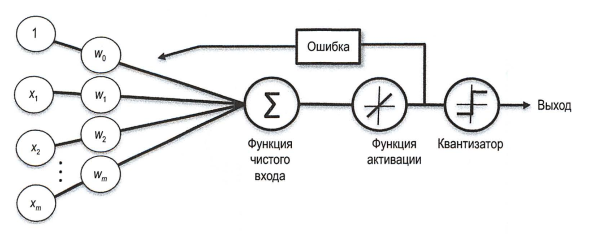

# adaline-binlogic
Попытка создать простой адаптивный нейрон для обучения простейшим логическим функциям



## Устранение зависимостей
Не требуется, алгоритм использует только функции стандартной библиотеки

## Пример работы программы для логической функции and

```bash
$ python3 adaline.py
Weights: [-0.019999999999999997, 0.01, 0.01]
Costs: [1.5, 0.5, 0.5, 1.0, 0.5, 0.0, 0.0, 0.0, 0.0, 0.0]
```

Как видим, алгоритм сходится на шестой эпохе

## Алгоритм шаг за шагом
Разберём пошагово первые шесть эпох

X = [[0, 0], [0, 1], [1, 0], [1, 1]]

y = [0, 0, 0, 1]
### Эпоха 1

weigths = [0, 0, 0]

output = [1, 1, 1, 1]

errors = [0 - 1, 0 - 1, 0 - 1, 1 - 1] = [-1, -1, -1, 0]

w[0] = 0 + 0.01 * (-1 - 1 - 1 + 0) = -0.03

w[1] = 0 + 0.01 * (0 * -1 + 0 * -1 + 1 * -1 + 1 * 0) = -0.01

w[2] = 0 + 0.01 * (0 * -1 + 1 * -1 + 0 * -1 + 1 * 0) = -0.01

error = (-1^2 + -1^2 + -1^2 + 0^2) / 2 = 1.5

Новые веса: [-0.03, -0.01, -0.01]

### Эпоха 2

output = [0, 0, 0, 0]

errors = [0 - 0, 0 - 0, 0 - 0, 1 - 0] = [0, 0, 0, 1]

w[0] = -0.03 + 0.01 * (0 + 0 + 0 + 1) = -0.03 + 0.01 = -0.02

w[1] = -0.01 + 0.01 * (0 * 0 + 0 * 0 + 1 * 0 + 1 * 1) = -0.01 + 0.01 = 0

w[2] = -0.01 + 0.01 * (0 * 0 + 1 * 0 + 0 * 0 + 1 * 1) = -0.01 + 0.01 = 0

error = (0^2 + 0^2 + 0^2 -1*2) / 2 = 0.5

Новые веса: [-0.02, 0, 0]

### Эпоха 3

output = [0, 0, 0, 0]

errors = [0 - 0, 0 - 0, 0 - 0, 1 - 0] = [0, 0, 0, 1]

w[0] = -0.02 + 0.01 * (0 + 0 + 0 + 1) = -0.01

w[1] = 0 + 0.01 * (0 * 0 + 0 * 0 + 1 * 0 + 1 * 1) = 0 + 0.01 = 0.01

w[2] = 0 + 0.01 * (0 * 0 + 1 * 0 + 0 * 0 + 1 * 1) = 0 + 0.01 = 0.01

error = (0 ^ 2 + 0 ^ 2 + 0 ^ 2 + 1 ^ 2) / 2 = 0.5

Новые веса: [-0.01, 0.01, 0.01]

### Эпоха 4

output = [0, 1, 1, 1]

errors = [0, -1, -1, 0]

w[0] = -0.01 + 0.01 * -2 = -0.03

w[1] = 0.01 + 0.01 * (0 * 0 + 0 * -1 + 1 * -1 + 1 * 0) = 0.01 - 0.01 = 0

w[2] = 0.01 + 0.01 * (0 * 0 + 1 * -1 + 0 * -1 + 1 * 0) = 0.01 - 0.01 = 0

error = (0 ^ 2 + -1 ^ 2 + -1 ^ 2 + 0 ^ 2) = 1

Новые веса: [-0.03, 0, 0]

### Эпоха 5

output = [0, 0, 0, 0]

errors = [0, 0, 0, 1]

w[0] = -0.03 + 0.01 = -0.02

w[1] = 0 + 0.01 * (1 * 1) = 0.01

w[2] = 0 + 0.01 * (1 * 1) = 0.01

error = 0.5

Новые веса: [-0.02, 0.01, 0.01]

### Эпоха 6

output = [0, 0, 0, 1]

errors = [0, 0, 0, 0]

Изменение в весах нет

error = 0

Алгоритм сошёлся
